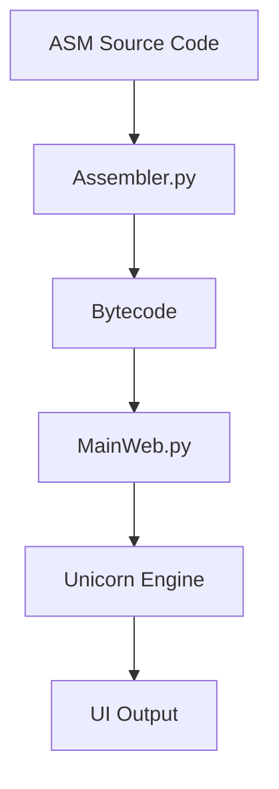

# ARMulator Unicorn
**Based on [ARMulator](https://github.com/Filippo2903/ARMulator).**

## 1. ARMulator: ARM Architecture Emulator   

ARMmulator is a lightweight ARMv7 emulator tool based on Unicorn Engine framework.It fills the gap between assembly source code and hardware-level execution by integrating a custom assembler, memory management, and state history tracking. 

## 2. Requirements & Installation   

### Prerequisites
- Python 3.13.xx
- Create `venv`
- `pip install --upgrade pip`
- Install `requirements.txt`
  
## 3. User Guide
Run the emulator by passing an assembly file as an argument (**at the moment**):

`python3 mainweb.py`

## 4. Architecture Overview

| Segment | Variable Name | Purpose | 
| ------- | ------------- | ------- |
| **INTVEC** | `INTVEC_ADDR` | Interupt Vector Table storage |
| **CODE** | `CODE_ADDR` | Executable machine instructions |
| DATA | `DATA_ADDR` | Static data and variable storage |

## 5. General Purpose

This repository contains Python source files developed for educational purposes
as part of a collaborative university project at Torvegata(Uni2 of Rome).

